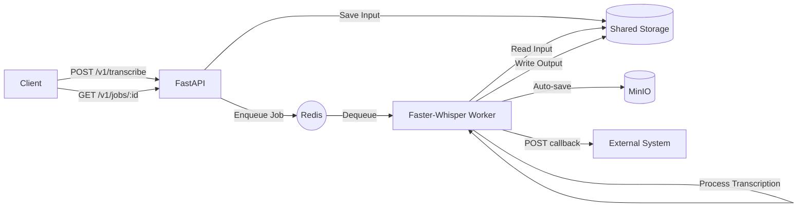

# Whisper Transcribe Worker API

A high-performance transcription service using [Faster-Whisper](https://github.com/SYSTRAN/faster-whisper), FastAPI, and Redis Queue (RQ). Supports URL downloads, file uploads, multiple output formats (SRT, VTT, TXT), MinIO auto-save, and Webhook callbacks.

## 🏗 Architecture



## 🚀 Quick Start

Ensure you have Docker and Docker Compose installed.

```bash
# Clone the repository
git clone https://github.com/your-repo/whisper-transcribe-worker-api.git
cd whisper-transcribe-worker-api

# Start the services
docker-compose up -d
```

The API will be available at `http://localhost:8080` (or your configured port).

## 📡 API Reference

### 1. Create Transcription Job
`POST /v1/transcribe`

Submit a media URL or upload a file for transcription.

**Request Parameters:**
| Field | Type | Required | Description |
|---|---|---|---|
| `source_type` | string | Yes | `url` or `upload` |
| `url` | string | Conditional | Required if `source_type` is `url` |
| `file` | file | Conditional | Required if `source_type` is `upload` |
| `language` | string | No | Language code (e.g., `id`, `en`). |
| `task` | string | No | `transcribe` (default) or `translate` |
| `output` | string | No | `srt` (default), `vtt`, or `txt` |
| `callback_url` | string | No | URL to POST results to upon completion |
| `db_id` | string | No | Custom ID for database tracking |

**Example (URL):**
```bash
curl -X POST http://localhost:8080/v1/transcribe \
  -H "Content-Type: application/json" \
  -d '{
    "source_type": "url",
    "url": "https://example.com/audio.mp3",
    "callback_url": "https://your-api.com/webhook",
    "db_id": "job_12345"
  }'
```

---

### 2. Webhook Callback Body
When a job is finished, the worker will send a `POST` request to your `callback_url` with the following JSON:

```json
{
  "job_id": "84829b12-6bc2-4bd0-8e21-6f33b52fc3b0",
  "status": "finished",
  "language": "id",
  "duration": 3631.2,
  "output": "srt",
  "minio_url": "http://minio.example.com/transcribe/84829b12.../output.srt",
  "db_id": "job_12345"
}
```

---

### 3. Check Job Status
`GET /v1/jobs/{job_id}`

Track progress and get results.

**Response:**
```json
{
  "job_id": "...",
  "status": "started",
  "progress": 45,
  "queue_position": 0,
  "minio_url": null,
  "created_at": "2026-01-03T14:01:50.363Z",
  "error": null
}
```

## ⚙️ Configuration

Environment variables in `docker-compose.yaml`:

| Variable | Default | Description |
|---|---|---|
| `MODEL_SIZE` | `small` | Whisper model size (`tiny`, `base`, `small`, `medium`, `large-v3`) |
| `MAX_CONCURRENCY` | `2` | Max parallel jobs per worker container |
| `JOB_TIMEOUT` | `14400` | Max processing time (4 hours) |
| `MINIO_ENDPOINT` | | MinIO server address |
| `MINIO_BUCKET` | `transcribe` | Destination bucket |

## 🛠 Features

- **Parallel Processing**: Handles multiple jobs simultaneously using internal process management.
- **Auto-Save**: Integrated with MinIO for persistent storage.
- **Webhook**: Real-time notifications upon completion.
- **Robust**: Automatic worker restart and increased heartbeat tolerance.
