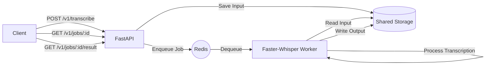

# Whisper Transcribe Worker API

A high-performance transcription service using [Faster-Whisper](https://github.com/SYSTRAN/faster-whisper), FastAPI, and Redis Queue (RQ). Supports URL downloads, file uploads, and multiple output formats (SRT, VTT, TXT).

## 🏗 Architecture



## 🚀 Quick Start

Ensure you have Docker and Docker Compose installed.

```bash
# Clone the repository
git clone https://github.com/your-repo/whisper-transcribe-worker-api.git
cd whisper-transcribe-worker-api

# Start the services
docker-compose up -d
```

The API is available internally to other Docker containers.

> [!IMPORTANT]
> **INTERNAL ACCESS ONLY:**
> Access the API at `http://transcribe-api:8080` from other containers in the same network (e.g., n8n). External access via `localhost` is disabled for security.

## 📡 API Reference

### 1. Create Transcription Job
`POST /v1/transcribe`

Submit a media URL or upload a file for transcription.

**Internal URL:** `http://transcribe-api:8080/v1/transcribe`

**Request Body:**

| Field | Type | Required | Description |
|---|---|---|---|
| `source_type` | string | Yes | `url` or `upload` |
| `url` | string | Conditional | Required if `source_type` is `url` |
| `file` | file | Conditional | Required if `source_type` is `upload` |
| `language` | string | No | Language code (e.g., `id`, `en`). Auto-detect if omitted. |
| `task` | string | No | `transcribe` (default) or `translate` (to English) |
| `output` | string | No | `srt` (default), `vtt`, or `txt` |

**Example (URL - JSON):**
```bash
curl -X POST http://transcribe-api:8080/v1/transcribe \
  -H "Content-Type: application/json" \
  -d '{
    "source_type": "url",
    "url": "https://example.com/audio.mp3",
    "output": "srt"
  }'
```

**Example (Upload - Form Data):**
```bash
curl -X POST http://transcribe-api:8080/v1/transcribe \
  -F "source_type=upload" \
  -F "file=@/path/to/audio.mp3" \
  -F "output=srt"
```

**Response:**
```json
{
  "job_id": "550e8400-e29b-41d4-a716-446655440000",
  "status_url": "/v1/jobs/550e8400-e29b-41d4-a716-446655440000",
  "result_url": "/v1/jobs/550e8400-e29b-41d4-a716-446655440000/result"
}
```

### 2. Check Job Status
`GET /v1/jobs/{job_id}`

Track the progress of a transcription job.

**Response:**
```json
{
  "job_id": "...",
  "status": "finished",
  "progress": 100,
  "message": "done",
  "created_at": "...",
  "started_at": "...",
  "ended_at": "...",
  "error": null
}
```

### 3. Get Result
`GET /v1/jobs/{job_id}/result`

Download the generated transcription file (`.srt`, `.vtt`, or `.txt`).

---

## ⚙️ Configuration

Environment variables in `docker-compose.yaml`:

| Variable | Default | Description |
|---|---|---|
| `ROLE` | `api` | Container role: `api` (starts FastAPI) or `worker` (starts RQ worker) |
| `MODEL_SIZE` | `small` | Whisper model size (`tiny`, `base`, `small`, `medium`, `large-v3`) |
| `DEVICE` | `cpu` | Processing device (`cpu` or `cuda`) |
| `COMPUTE_TYPE` | `int8` | Quantization (`int8`, `float16`, etc.) |
| `MAX_CONCURRENCY` | `1` | Max concurrent jobs per worker |
| `JOB_TTL_SECONDS` | `86400` | How long job results are stored in Redis (seconds) |

## 🛠 Prerequisites

- **FFmpeg**: Required for audio processing (included in Docker images).
- **Shared Volume**: Ensure `transcribe-data` volume is correctly mapped for API/Worker interaction.

## ❓ Troubleshooting

### ImportError: cannot import name 'get_queue' from 'queue'
This error occurs because of a naming conflict between the local `queue.py` and the Python standard library. The files have been renamed to `redis_queue.py` to resolve this.

If you encounter this error, you must **rebuild** your Docker images to apply the fix:

```bash
docker-compose down
docker-compose up -d --build
```
